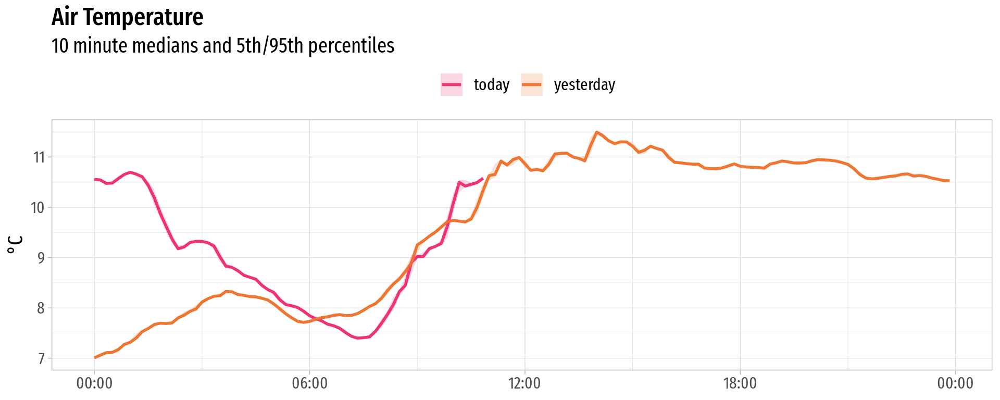
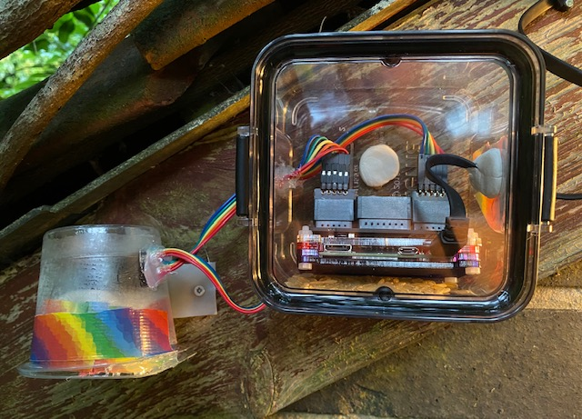

# Observatory 
Python & kdb+tick environment logging. Summary is updated every 5 minutes to [https://o.nikhouri.com](https://o.nikhouri.com)



```
q)select now:last data, lo:min data, median:med data, hi:max data by last time,host,sym,units from obs
time                 host   sym         units| now      lo       median   hi      
---------------------------------------------| -----------------------------------
0D21:00:23.395481000 garden cpu         pct  | 9.4      1.2      2.7      67.1    
0D21:00:23.395481000 garden cputemp     C    | 21.254   18.564   21.792   27.71   
0D21:00:23.395481000 garden humidity    pct  | 82.43135 59.62178 78.23818 84.90719
0D21:00:23.395481000 garden mem         pct  | 23.4     23.3     23.3     24.3    
0D21:00:23.395481000 garden pressure    hPa  | 1022.278 1022.165 1023.204 1024.512
0D21:00:23.395481000 garden temperature C    | 9.59528  7.507809 10.63044 15.02516
0D21:00:23.395481000 rpi    cpu         pct  | 10.4     5.4      6.1      92.7    
0D21:00:23.395481000 rpi    cputemp     C    | 46.251   41.381   44.303   54.53   
0D21:00:23.395481000 rpi    mem         pct  | 55.2     49.2     50.5     58.7    
```

# kdb+tick
The kdb+tick deployment is a stock install, barring the addition of a UTC timezone change at the top of all scripts (`tick.q`, `r.q`, and `u.q`). Necessary as the host doesn't run UTC.

```
\o 0
```
None of the scripts are included in the repository, they're all symlinked ag. the standard install location in `~/q` and `~/q/tick`.

# Colour Spin on the MICS chip
Sometimes WiFi connectivity will drop, and it's tough to see if the weather station is truly dead or just having a bad time connecting. Every hour, the station signals if it's alive or not by flashing a rainbow on the MICS LED.

The cron job to do this is:

```
0 * * * * python3 /home/pi/observatory/colourspin.py
```

# Hardware

* Raspberry Pi Zero W
* BME280 (Temperature, Humidity, Air Pressure)
* MICS6814 (Oxidizing Gas, Reducing Gas, Ammonia) 

